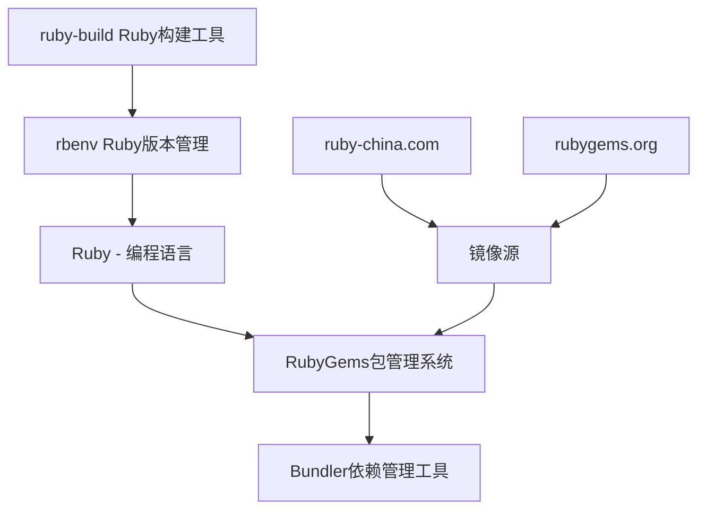

# Ruby

下面是一些工具与关系的介绍

* **Ruby** → 编程语言（类似 **Python**）
* **RubyGems** → Ruby 的包管理系统（类似 **pip**）
* **Bundler** → 项目依赖管理工具（类似 **requirements.txt + pip-tools/poetry**，比 pip 单独用更接近 poetry/pipenv）
* **Jekyll 插件**（如 `jekyll-paginate` 等）→ 类似 **Django/Flask 的插件或扩展**
* **rbenv** → Ruby 版本管理工具（类似 **pyenv**）
* **ruby-build** → rbenv 的插件，用来编译安装 Ruby（类似 **pyenv 的插件 pyenv-install**）



## 安装 ruby

[Downloads](https://rubyinstaller.org/downloads/)

```shell
ruby -v
```

=== "linux or wsl"

    ```shell 
    sudo apt update && sudo apt upgrade -y
    sudo apt install ruby-dev ruby-bundler nodejs
    ```

    ```shell
    git clone https://github.com/rbenv/rbenv.git ~/.rbenv
    echo 'export PATH="$HOME/.rbenv/bin:$PATH"' >> ~/.bashrc
    echo 'eval "$(rbenv init - bash)"' >> ~/.bashrc
    source ~/.bashrc

    git clone https://github.com/rbenv/ruby-build.git ~/.rbenv/plugins/ruby-build
    ```

=== "macos"

    ```shell title="macos"
    brew install rbenv ruby-build
    ```


    ```shell title="macos"
    echo 'eval "$(rbenv init - zsh)"' >> ~/.zshrc
    source ~/.zshrc
    ```

```shell
rbenv install 3.2.4
rbenv global 3.2.4
exec $SHELL
```

```shell
ruby -v
```

```shell
$ which rbenv

> /home/user/.rbenv/bin/rbenv

$ rbenv versions
> 看看有没有3.2.4
```

### rubygems

[下载 RubyGems](https://rubygems.org/pages/download)

下载后解压到任意路径。打开 Windows 的 cmd 界面，输入命令：

```shell
cd 解压的路径
```

```shell title="升级 RubyGems"
gem update --system
```

```shell title="macos"
brew install gem
```

### 切换镜像源

```shell
# 添加镜像源并移除默认源
gem sources --add https://mirrors.tuna.tsinghua.edu.cn/rubygems/ --remove https://rubygems.org/
```

```shell title="列出已有源"
gem sources -l # 应该只有镜像源一个
```

```shell title="验证"
*** CURRENT SOURCES ***
https://gems.ruby-china.com/
```

### 安装 Bundler

安装 一个名为 Bundler 的程序 —— ��于自动安装其他所需的程序

```shell
gem install bundler
```

---

## 标准安装流程（Ruby ≥ 3.2）

!!! example "完整配置方案"
    **目标：** 使用 Ruby ≥ 3.2 + 正确的 bundler + 无权限问题

    ### Step 1：更新 ruby-build（核心一步）

    ```bash
    # 首次安装
    git clone https://github.com/rbenv/ruby-build.git ~/.rbenv/plugins/ruby-build

    # 如果已存在，更新
    cd ~/.rbenv/plugins/ruby-build && git pull

    rbenv rehash

    # 验证可用版本
    rbenv install --list | grep 3.
    ```

    ### Step 2：安装并切换 Ruby（推荐 3.2.2）

    ```bash
    rbenv install 3.2.2
    rbenv global 3.2.2

    # 验证
    ruby -v
    # ruby 3.2.2
    ```

    ### Step 3：重新安装 bundler（不再需要 --user-install）

    ```bash
    gem install bundler
    bundle -v
    ```

    ### Step 4：重新安装项目依赖

    ```bash
    cd ~/cv
    rm -f Gemfile.lock
    bundle install
    # 或
    make install
    ```

    **注意事项：**
    - 确保 ruby-build 是最新版本，否则���能无法安装新版 Ruby
    - Ruby ≥ 3.2 后不再需要 `--user-install` 参数
    - 删除 `Gemfile.lock` 可以强制重新解析依赖
